# Upgrading Classic Macintosh

 

<table cellpadding="0" cellspacing="0" width="100%">
<tr><td>

</td><td>

**<u>DISCHARGE</u> the CRT before to touch any internal parts of your Mac.**

</td></tr>

<tr><td>

</td><td>

**Please refer to [issues](https://github.com/way5/mac-classic-pram-battery-bay/issues) :beetle: if you have any suggestion or found an error.**

</td></tr>
</table>

 

## **- [Macintosh Classic](./OBJ-STL/macintosh%20classic/)**

<table cellpadding="0" cellspacing="0" width="100%">
<tr><td width="160px">

</td><td>
The PRAM battery compartment sits between the logic board and the case (see photos). Batteries will serve longer if you choose to use it from the same manufaturer and maintain them well charged. In my experience 3.2-3.9V total is enougn for proper functioning.
</td></tr></table>

 

**BOM:**

1. PRAM battery compartment
   - Wire <= AWG22 ~ 0.1 m
   - Single flat contact plates for AA, AAA batteries - 6 pcs.

---

**PLEASE NOTE**: \
Before to install the battery compartment with the batteries inside it should be electrically isolated from the logic board, otherwise the permanent damage of electrical circuits might occur. For that purpose I'm using thin (~0.5mm) transparent film, wrapping it over the battery compartment and securing it on the connector (see photos).

---

### **+ Photos**

|  |  |  | 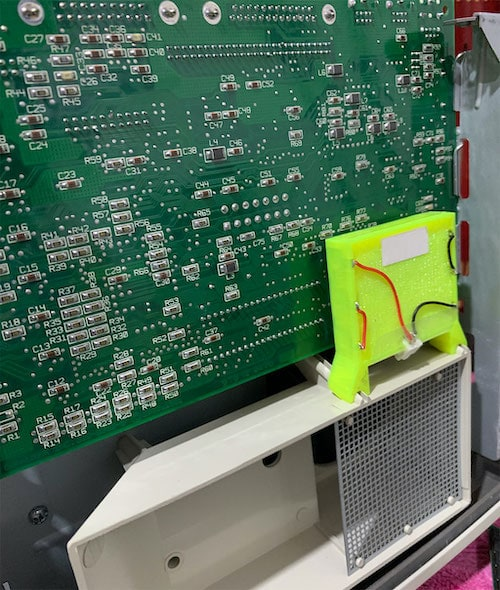 |
|:---:|:---:|:---:|:---:|

 

## **- [Macintosh Plus](./OBJ-STL/macintosh%20plus/)**

<table cellpadding="0" cellspacing="0" width="100%">
<tr><td width="160px">
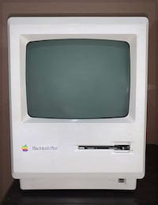
</td><td>

PRAM Battery.  The battery case is pretty much as for previous model with the only difference, it attaches directly to standard battery holder of Mac. Despite it designed to use 4.5V battery, in my experience 3.5 ± 0.4V is enough.   Cooling Fan (Noninvasive method).  Mac Plus was designed to be cooled passively via natural convective flow through the ventilation grates all over its housing. Usually this is not enough, so it gets noticeably hot, so the cooling fan may be installed in order to make Mac's life longer.

</td></tr></table>

 

**BOM:**

1. PRAM battery compartment
   - Wire <= AWG22 ~ 0.1m
   - Single flat contact plates for AA, AAA batteries - 6 pcs.
   - Copper foil ~ 30mm2

### **+ Photos**

| 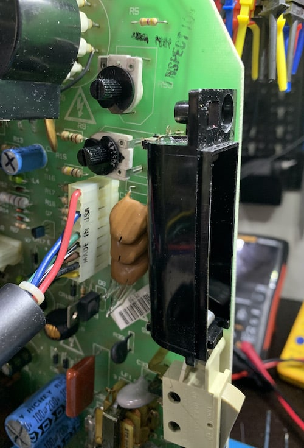 | 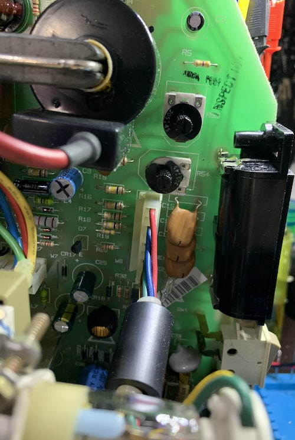 | 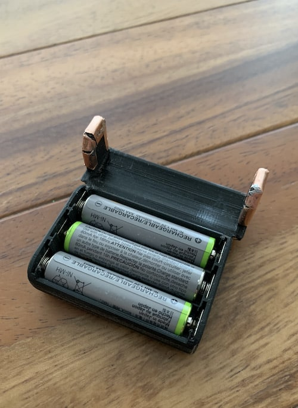 | 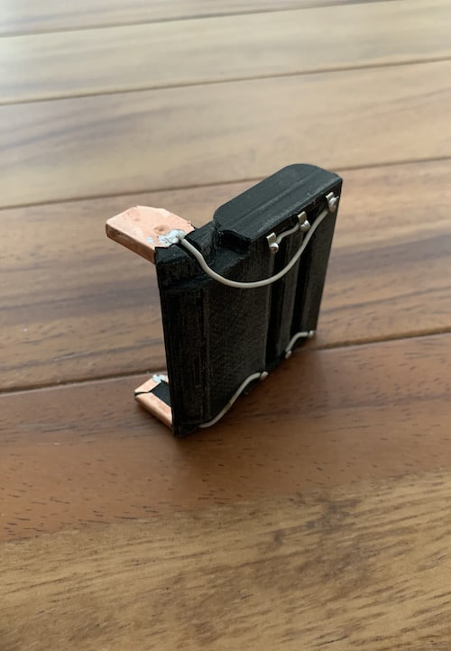 | 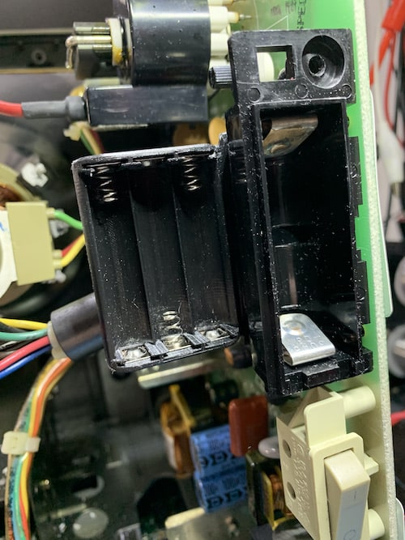 |  |
|:---:|:---:|:---:|:---:|:---:|:---:|

 

2. Cooling fan
   - Bolts M3 - 4 pcs.
   - Thru Threaded Inserts M3 - 4 pcs.
   - Washer Head Screws (for plastic) - 2 pcs.
   - Wire <= AWG22 - 0.5m
   - Diode rectifier (ex. 1N4007) - 1 pcs.
   - Resistor (~50Ω) - 1 pcs.
   - Double sided tape.
 Optional:
   - Copper foil ~ 30mm2

 

---

**PLEASE NOTE:**: \
I'd not recommend you to use the fancy connector that you can see on the photos below, unless you know what you are doing. It requires that its both parts to be perfectly aligned, so when you close the housing it makes secure contact at all times. 
A much secure solution is to use any of the following connectors:

---

### **+ Photos**

|  |  | 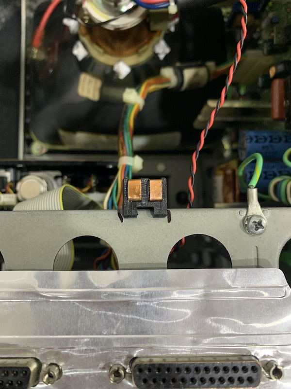 | 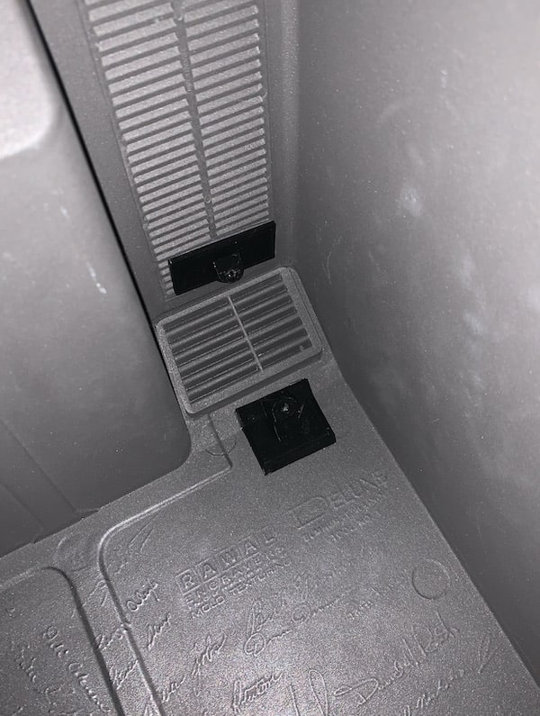 | 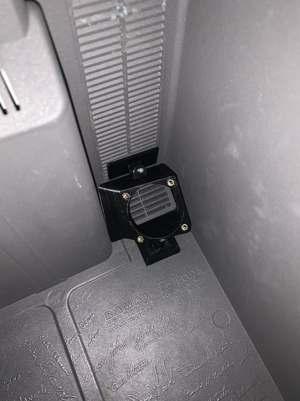 |  | 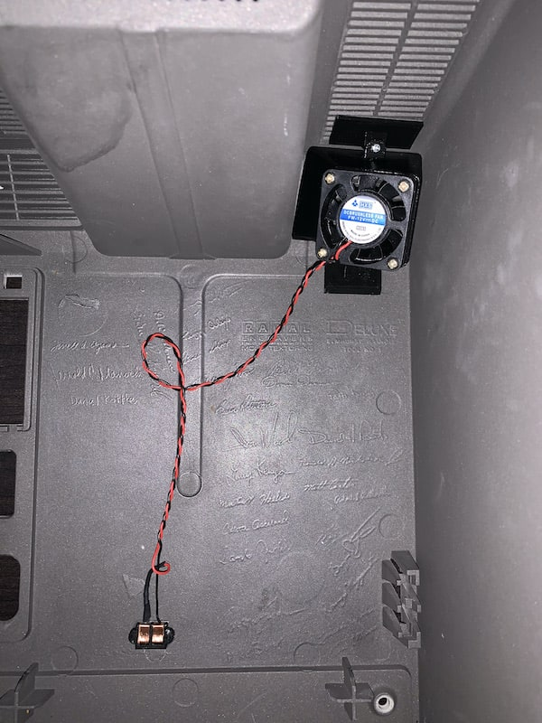 |
|:---:|:---:|:---:|:---:|:---:|:---:|:---:|

 

## **[- Zero Track Finder](./OBJ-STL/sony%20MP-F75W/) (DO NOT USE if your drive works properly)**

<table cellpadding="0" cellspacing="0" width="100%">
<tr><td width="160px">

</td><td>

A simple tool which may help you to adjust zero track sensor on SONY-F75W-XX floppy drives. Place it over the sensor and secure the assembly. Loosen the sensor screw and slowly adjust the knob, insert the disk. If zero track has been found the floppy will start reading properly, if not repeat adjustment and insert the disk again. Once you finished, secure the sensor on its place and take off Zero Finder assembly.

</td></tr></table>

### **+ Photos**

| 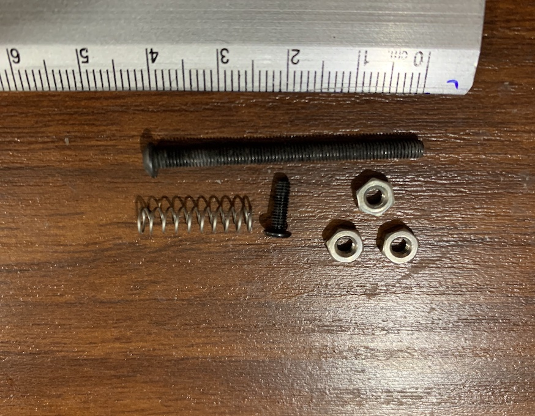 |  | 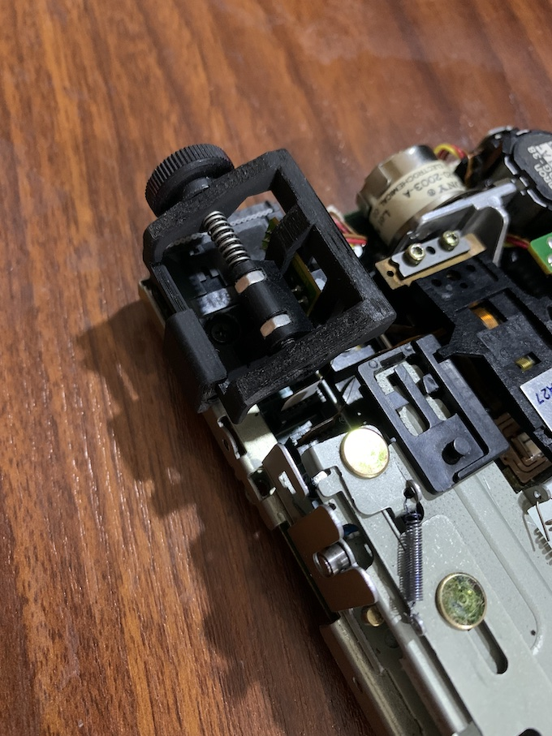 | 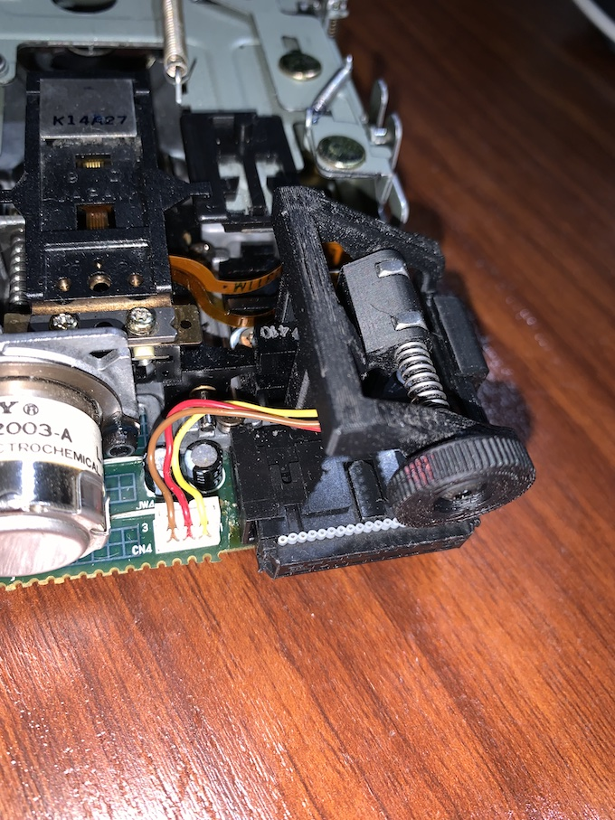 |
|:---:|:---:|:---:|:---:|
 

## **+ [Apple II](./OBJ-STL/apple%20II/)**

### **- [Datanektics Keyboard, key switch shackle](./OBJ-STL/apple%20II/datanectics%20keyboard%20switch%20shackle.stl)**

<table cellpadding="0" cellspacing="0" width="100%">
<tr><td width="160px">

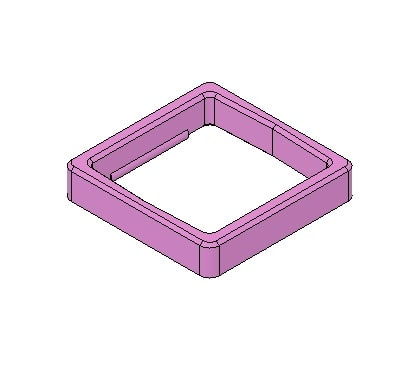

</td><td> 

There are a multiple ways to repair Apple II's Datanektiks keyboard. My decision was to crack open all malfunctioning key switches to give them a proper maintainment. When the key is back to work, clean and lubricated, you may glue the both halves of the key mechanism together as it was before or to leave the opportunity to painlessly open if it will fail again. The key swith shackle securely holds the both parts of the mechanism together and may be easily removed by whatever reason you need to open the switch in future.  <u>Hint: Be very careful when opening the key switch with the cutter knife, do not apply too much force. Open it from the opposite to the contact pins side.</u>

</td></tr></table>

### **- Photos**

| 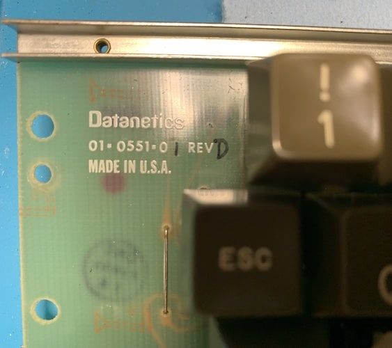 |  |  | 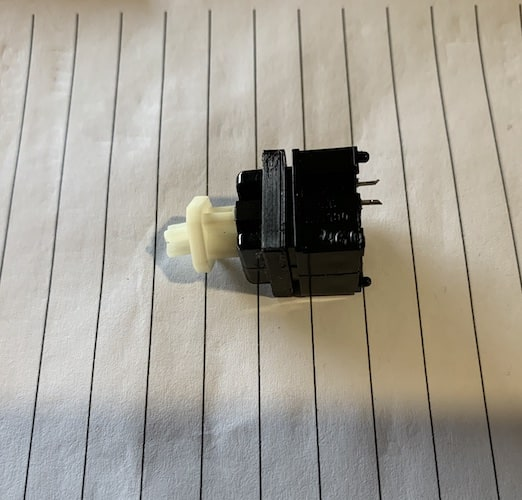 |
|:---:|:---:|:---:|:---:|

### **- [Rear insert](./OBJ-STL/apple%20II/rear%20insert.stl)**
<table cellpadding="0" cellspacing="0" width="100%">
<tr><td width="160px">
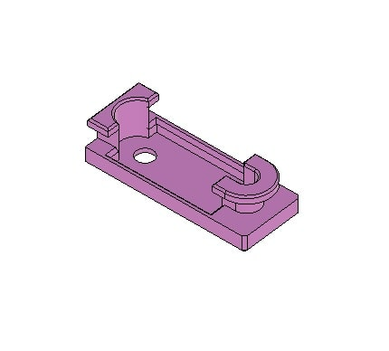
</td><td>

Just a simple insert, originally designed for Apple II+ in order to allow some cable management on the rear side of the housing.

</td></tr></table>

 

## **+ [Apple Keyboard (M7803)](./OBJ-STL/imac%20g4/m7809_keyboard_key_shaft.stl)**

<table cellpadding="0" cellspacing="0" width="100%">
<tr><td width="160px">
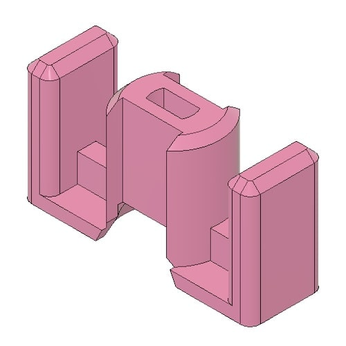
</td><td>

The Apple keyboards are rarely reliable particularly an old ones. Let's give a chance to one of the most fragile devices by modifying the switching mechanism, adding custom key shaft instead of an unreliable side clips.

</td></tr></table>

### **- Photos**

|  |  | 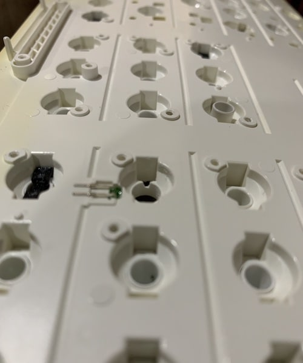 | 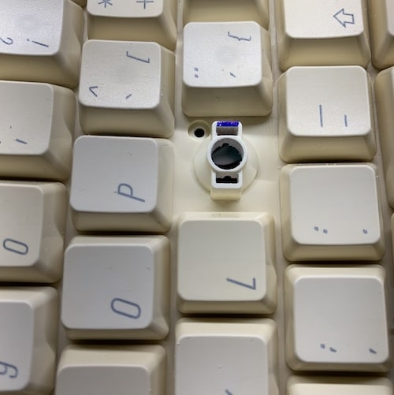 |
|:---:|:---:|:---:|:---:|

 