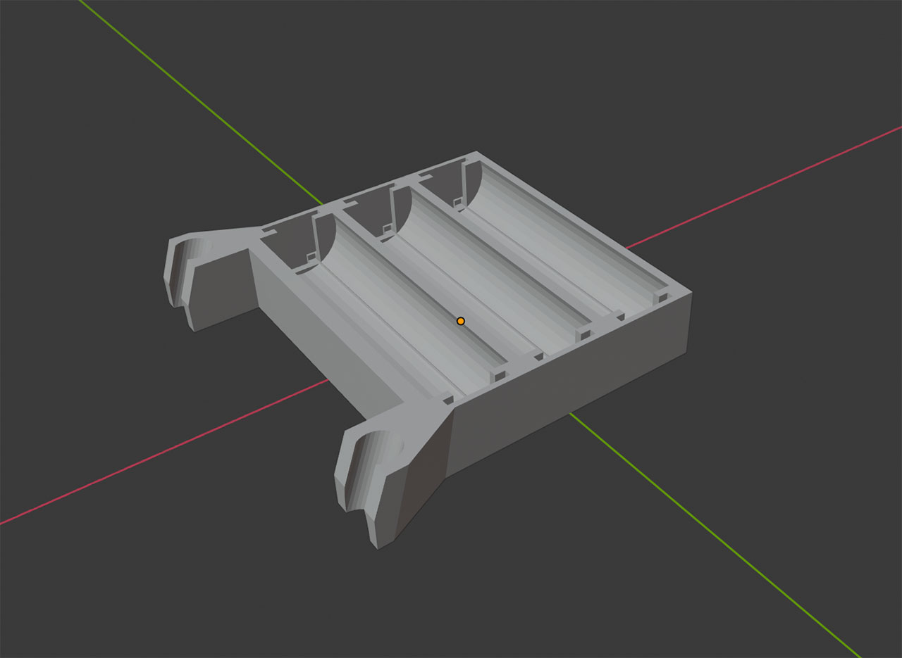
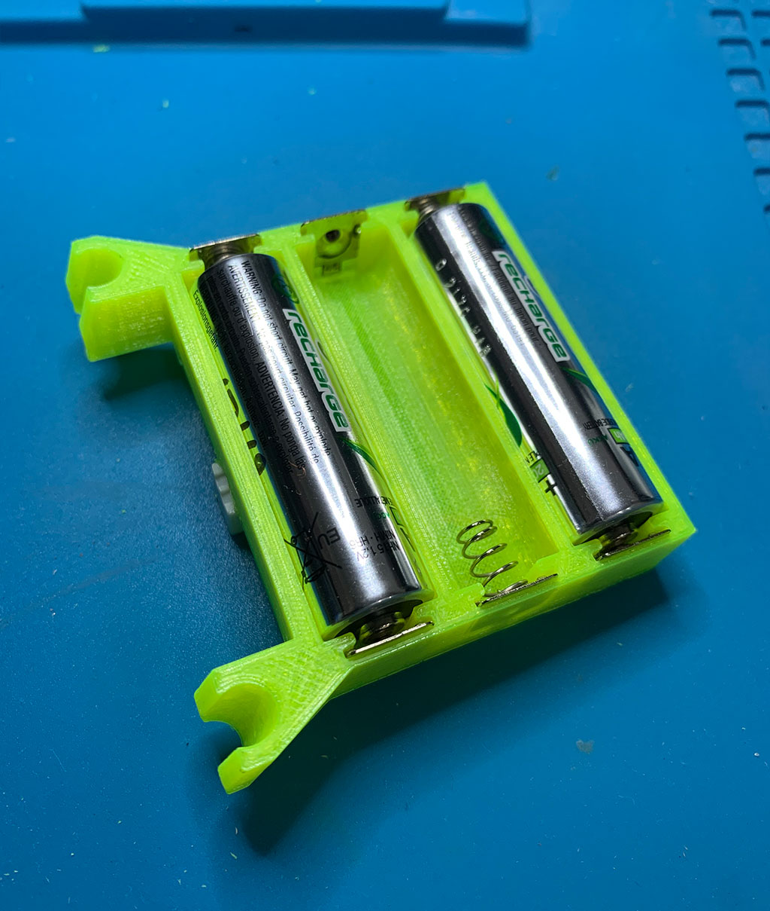
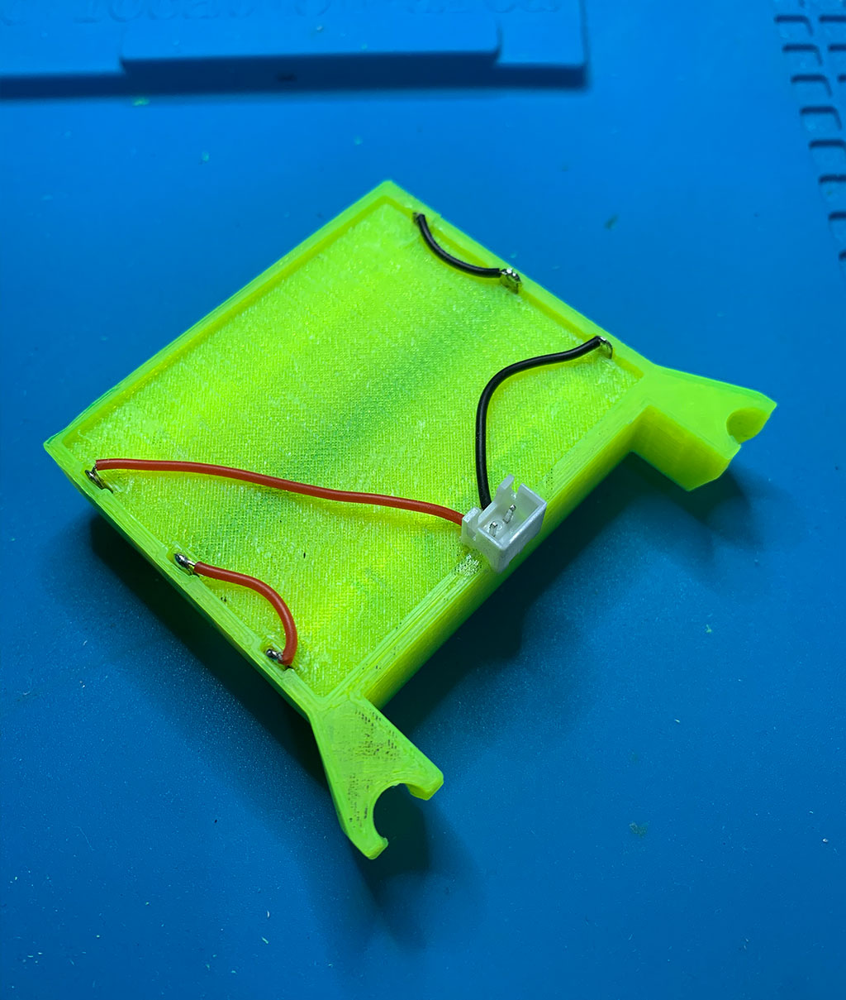
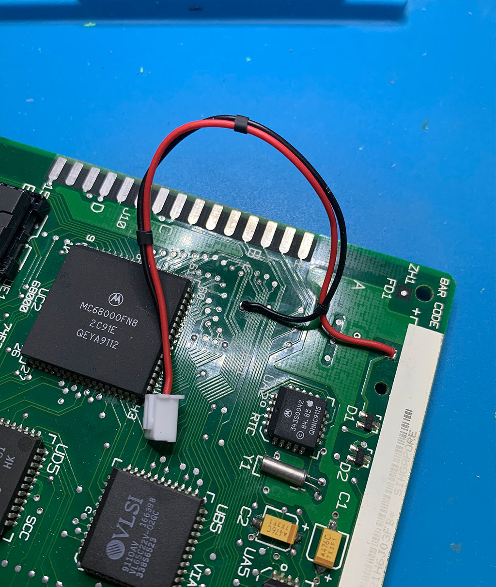
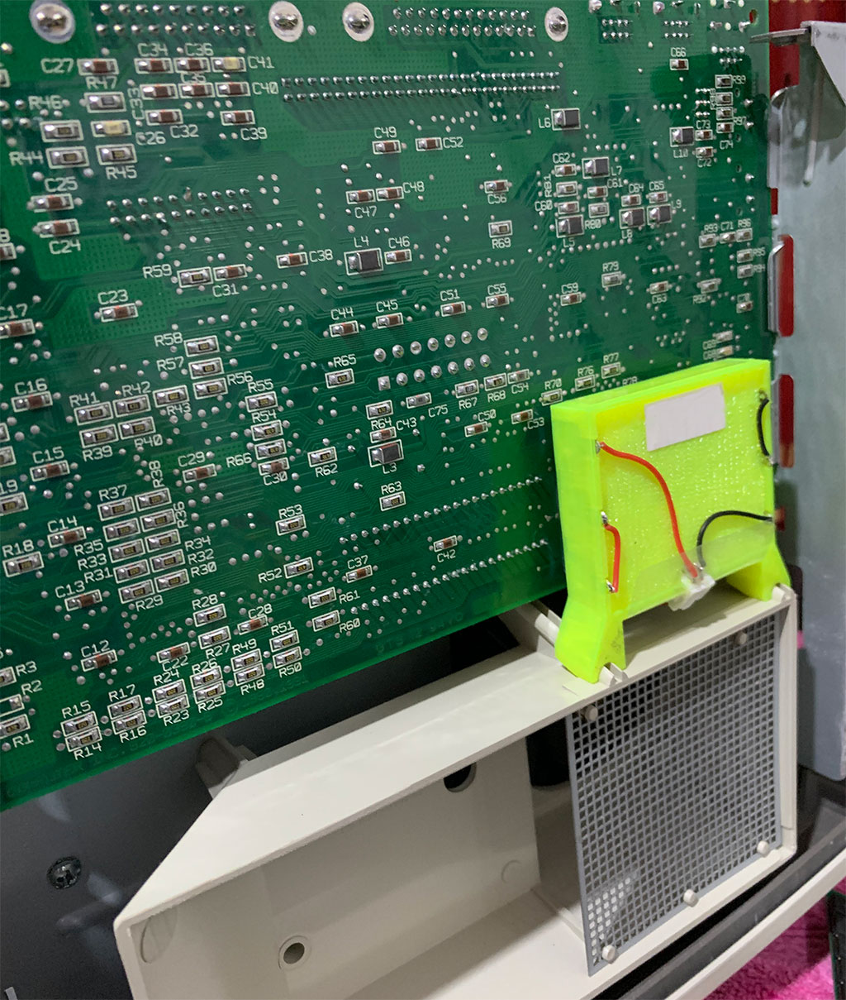

# Macintosh Classic PRAM Battery Holder
|  | Please refer to [issues](https://github.com/way5/mac-classic-pram-battery-bay/issues) :beetle: if you have any suggestion or found an error. &nbsp; &nbsp; &nbsp; &nbsp; &nbsp; &nbsp; &nbsp; &nbsp; &nbsp; &nbsp; &nbsp; &nbsp; &nbsp; &nbsp; &nbsp; &nbsp; &nbsp; &nbsp; &nbsp; &nbsp; &nbsp; &nbsp; &nbsp; &nbsp; &nbsp; &nbsp; &nbsp; &nbsp; &nbsp; &nbsp; &nbsp; &nbsp; &nbsp; &nbsp; &nbsp; &nbsp; &nbsp; &nbsp; &nbsp; |
| --- | --- |

## **+ Description**

The dimensions taken from a particular Macintosh model - M0420. You are always free to change the model for your Mac.

The battery holder locates in a small space between logic board and the case (see photos below). I am using 3 double A rechargable batteries with ~2000mAh each.

**PLEASE NOTE**: \
Before to install the holder with the batteries inside it should be electrically isolated from the logic board, otherwise the permanent damage of the electrical circuits may occur. For that purpose I was using thin (0.5mm) transparent film, wrapping it over the holder.

I'd recommend to use PLA plastic for printing. The temperatures are 60•C for heated bed and 200•C for extruder. In my case plastic almost isn't shrinked after cooldown. No further processing required.

~Enjoy

## **+ Photos**

|  |  |  |  |
| --- | --- | --- | --- |

## **+ Credits**

1. Main photo borrowed from [Wiki](https://en.wikipedia.org/wiki/Macintosh_Classic).